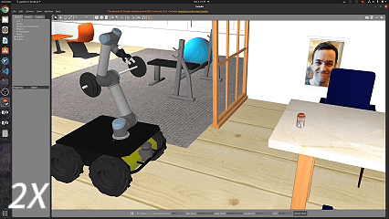

# Mobile Manipulator — ROS Noetic Workspace

A mobile manipulation system combining a Clearpath Husky UGV with a Universal Robots UR5 arm and Robotiq Hand-E gripper. The robot navigates autonomously, detects objects with GPU-accelerated YOLO, and accepts natural language commands via an LLM-powered agent.

---

## System Overview

```
Natural Language Command
        │
        ▼
  LLM Agent (OpenAI-compatible API)
        │  tool calls
        ▼
  MasterControl
  ├── Navigation  → move_base (AMCL / SLAM Toolbox)
  ├── Manipulation → MoveIt (UR5 arm + Hand-E gripper)
  └── Perception  → TensorRT YOLOv8 + PointCloud2
```

### :star:Features

| Layer | Technology |
|---|---|
| **Robot Base** | Clearpath Husky UGV — differential drive, 4-wheel |
| **Manipulator** | Universal Robots UR5 — 6-DOF, 850 mm reach |
| **Gripper** | Robotiq Hand-E — parallel-jaw, force-sensitive |
| **State Estimation** | robot_localization — EKF fusing wheel odometry and IMU |
| **Localization** | SLAM Toolbox (pose-graph SLAM) |
| **Navigation** | ROS Navigation Stack — navfn global planner + DWA local planner |
| **Motion Planning** | MoveIt + OctoMap + OMPL (RRTConnect) + KDL IK solver |
| **Object Detection** | YOLOv8m — ONNX model compiled to TensorRT for GPU inference |
| **3D Perception** | RGB-D depth image → PointCloud2 — 3D object localization for grasping |
| **LLM Agent** | OpenAI-compatible API (DeepSeek / Groq / Ollama / OpenAI) with tool-use |
| **Web UI** | Flask + HTML/JS — real-time command dashboard |
| **Simulation** | Gazebo 11 + AWS RoboMaker Small House World + gazebo-pkgs grasp plugin |

---

## :mortar_board:Prerequisites

- C++17 Compiler
- ROS Noetic (Ubuntu 20.04)
- Gazebo 11
- CUDA + TensorRT (for GPU-accelerated object detection)
- OpenCV
- Python 3.8+
- `catkin_tools` or `catkin_make`

Python dependencies:
```bash
pip install openai flask pydantic
```

---

## :rocket:Quick Start

1. Install ROS dependencies
```bash
cd ~/mobile_ws
rosdep update
rosdep install --from-paths src --ignore-src -r -y
```
2. Install Python requirements
```bash
pip install openai flask pydantic
```
3. Build workspace
```bash
cd ~/learning_ws
catkin build
source devel/setup.bash
```
4. Launch the system
```bash
export OPENAI_API_KEY="your-key-here"

chmod +x bringup.sh
./bringup.sh
# Open http://localhost:5000
```
Once running, open http://localhost:5000 in your browser to access the Web UI.

---

## :package:Packages

| Package | Description |
|---|---|
| `mobile_manipulator` | Core package — navigation, manipulation, vision, LLM agent, web UI |
| `husky_ur5_moveit_config` | MoveIt motion planning config for the Husky+UR5 |
| `robotiq` | Robotiq Hand-E gripper driver and description |
| `gazebo-pkgs` | Gazebo grasp/state/world simulation plugins |
| `aws-robomaker-small-house-world` | Realistic house environment for Gazebo |

---


## Architecture

### mobile_manipulator — Key Components

#### MasterControl (`src/mobile_manipulator/master_control.py`)
Core robot control API. Exposes high-level primitives used by the agent:

| Method | Description |
|---|---|
| `move_base_to(x, y, yaw)` | Navigate to a map pose |
| `move_arm_to_pick(class_name)` | Detect and pick a COCO object |
| `move_arm_to_place(location, height)` | Place held object |
| `get_current_pose()` | TF-based localization |
| `query_object_detection()` | Call TensorRT YOLO service |

Uses TF2, MoveIt, move_base action client, and PointCloud2 for 3D localization.

#### RobotAgent (`scripts/agent.py`)
LLM-powered autonomous agent. Accepts natural language commands and decomposes them into tool calls:

- `drive_to_location(name)` — navigate to a semantic room/location
- `pick_object(class)` — pick a COCO-class object
- `place_object(name, height)` — place at a semantic location
- `list_locations()` — query the semantic map

Supports any OpenAI-compatible backend (DeepSeek, Groq, Ollama, OpenAI).
```bash
export OPENAI_API_KEY=<your-key>          # or DEEPSEEK_API_KEY, GROQ_API_KEY
rosrun mobile_manipulator agent.py
```

#### TensorRT YOLO Node (`src/trt_yolo_node.cpp`)
Real-time object detection node:
- Model: YOLOv8m (ONNX → TensorRT engine)
- Input: 640×640 camera images
- Output: `/yolo/detections/image` topic + `DetectObjects` ROS service
- Classes: COCO-80, confidence threshold 0.5
```bash
rosrun mobile_manipulator trt_yolo_node
```

#### Flask Web UI (`scripts/flask_ui.py`)
Real-time web dashboard at `http://localhost:5000`:

| Endpoint | Method | Description |
|---|---|---|
| `/api/command` | POST | Send natural language command |
| `/api/map` | GET | Semantic map + robot pose |
| `/api/save_pose` | POST | Record current pose as named location |
| `/api/rooms` | GET | List all rooms |
| `/api/history` | GET | Conversation history |
| `/api/estop` | POST | Emergency stop toggle |
```bash
rosrun mobile_manipulator flask_ui.py
# Open http://localhost:5000
```

#### Semantic Map (`config/semantic_map.yaml`)
YAML database of ~50 named locations across 5 rooms (bedroom, living room, kitchen, dining room, study). Stores `(x, y, yaw)` poses and an object inventory per room. Persisted to disk when new locations are saved via the web UI.

---

## Robot Description

The URDF (`urdf/husky_ur5.urdf.xacro`) assembles:

1. **Husky UGV** — differential drive base
2. **SICK LMS1XX LiDAR** — mounted at 25.7 cm for obstacle detection
3. **UR5 arm** — 6-DOF, 850 mm reach, mounted on top plate
4. **Virtual ballast** — 30 kg mass to prevent tipping during arm extension
5. **Robotiq Hand-E gripper** — attached at UR5 `tool_0`

TF chain: `map → odom → base_link → ur5_base_link → ... → tool0 → gripper`

---

## Configuration

| File | Purpose |
|---|---|
| `config/nav/dwa_local_planner.yaml` | DWA local planner tuning |
| `config/nav/amcl.yaml` | AMCL localization parameters |
| `config/nav/costmap_common.yaml` | Shared costmap settings |
| `config/laser_filter_arm.yaml` | Filters arm self-returns from LiDAR |
| `config/ur5_controllers.yaml` | UR5 + gripper joint trajectory controllers |
| `config/slam_toolbox/` | SLAM Toolbox mapping and localization configs |
| `config/semantic_map.yaml` | Semantic navigation location database |

---

## LLM Backend

The agent uses the OpenAI Python SDK and works with any compatible API:

| Provider | Environment Variable |
|---|---|
| OpenAI | `OPENAI_API_KEY` |
| DeepSeek | `DEEPSEEK_API_KEY` |
| Groq | `GROQ_API_KEY` |
| Ollama (local) | No key required; set base URL |

---

## :envelope:Custom ROS Messages

**`msg/Detection.msg`** — Single object detection:
```
int32 x1, y1, x2, y2   # bounding box
string class_name
float32 confidence
```

**`srv/DetectObjects.srv`** — Detection service:
```
sensor_msgs/Image image
---
Detection[] detections
sensor_msgs/Image annotated_image
float32 inference_time_ms
```

---

## Acknowledgements

- [Clearpath Robotics](https://clearpathrobotics.com/) — Husky UGV platform and `husky_description` ROS package
- [Universal Robots](https://www.universal-robots.com/) — UR5 arm and `ur_description` ROS package
- [Robotiq](https://robotiq.com/) — Hand-E gripper and `robotiq` ROS package
- [MoveIt](https://moveit.ros.org/) — Motion planning framework for the UR5 arm
- [OctoMap](https://github.com/OctoMap/octomap) — Collisons avoidance for motion planning
- [ROS Navigation Stack](https://wiki.ros.org/navigation) — `move_base`, AMCL, navfn, and DWA planner
- [SLAM Toolbox](https://github.com/SteveMacenski/slam_toolbox) — Pose-graph SLAM and localization
- [Ultralytics YOLOv8](https://github.com/ultralytics/ultralytics) — Object detection model
- [AWS RoboMaker Small House World](https://github.com/aws-robotics/aws-robomaker-small-house-world) — Gazebo simulation environment
- [gazebo-pkgs](https://github.com/JenniferBuehler/gazebo-pkgs) — Gazebo grasp and state simulation plugins
